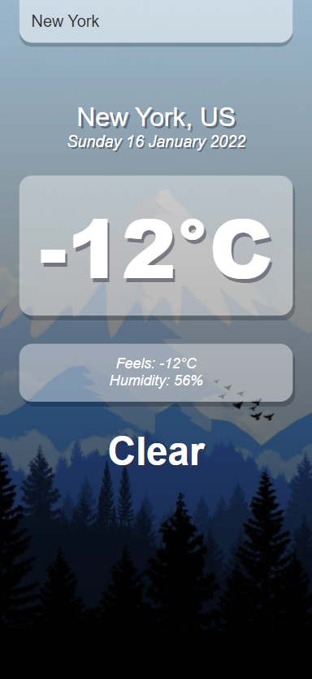
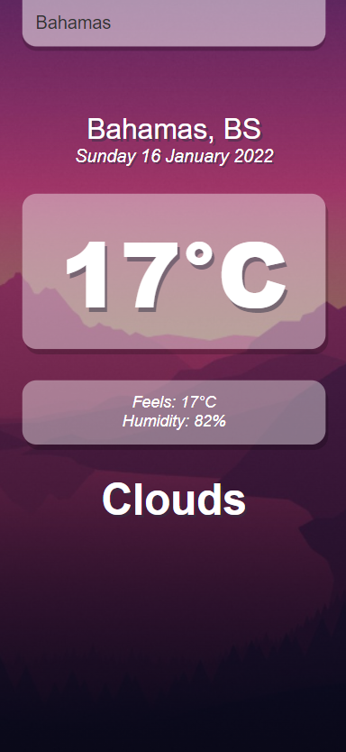

# Awesome Weather App
This project was bootstrapped with [Create React App](https://github.com/facebook/create-react-app).

 

## Getting Started
These instructions will get you a copy of the project up and running on your local machine for development and testing purposes. If you want to make a change, please use the develop branch and open a pull request.

## How to use
First you need to download project.

````
git clone https://github.com/rknyryn/Awesome-Weather-App.git
````

And install all dependencies and run.

````
npm install
npm start
````

## Author
* **Ramazan Kaan Yarayan** - [Github](https://github.com/rknyryn)
